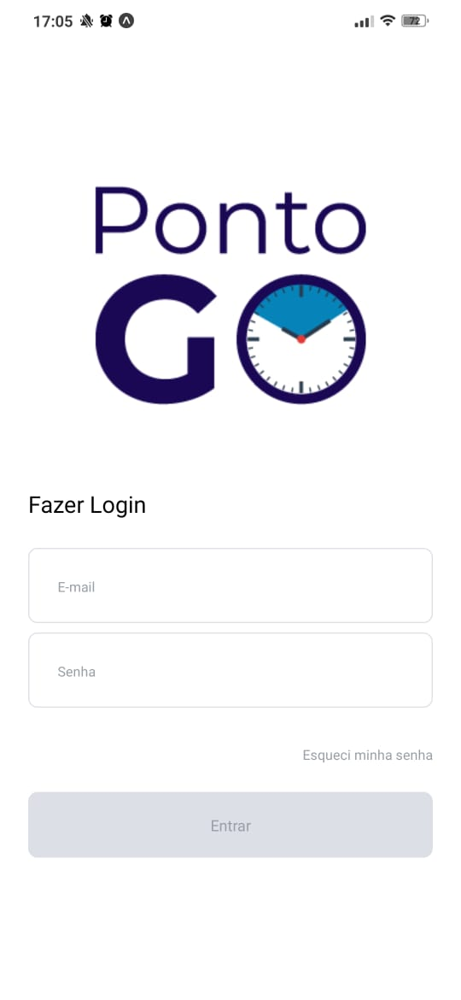
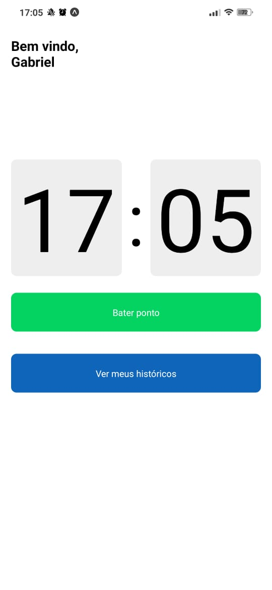
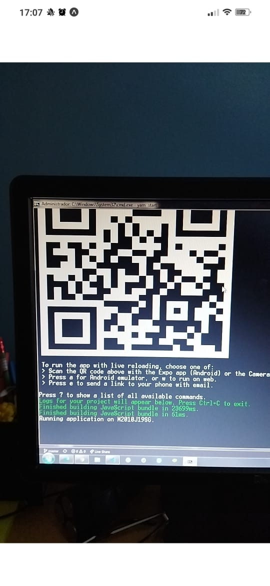
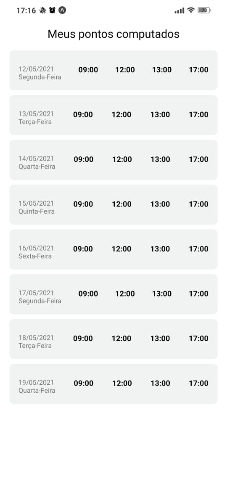

# :pushpin: Table of Contents

* [Technologies](#computer-technologies)
* [Features](#rocket-features)
* [How to Run](#construction_worker-how-to-run)

### Mobile Screenshot
<div>
   
   
   
   
   
</div>

# :computer: Technologies
This project was made using the following technologies:

* [React with typescript](https://reactjs.org/)      
* [React Native with typescript](https://reactnative.dev/)      
* [Expo with typescript](https://docs.expo.io/)      


# :rocket: Features

* App to register the hours of workers in some company

# :construction_worker: Run Project 

To run the mobile project you need a cellphone with the app of [expo](https://play.google.com/store/apps/details?id=host.exp.exponent) instaled or a emulator android/ios.
<br />
After, fork this repository and clone to your machine. Inside of the project's folder run the following commands:

```bash
# Clone Repository
$ git clone https://github.com/gmorae/portal-de-horas.git

# Go to mobile folder
$ cd portal-de-horas

# Install Dependencies
$ yarn or npm i

# Run Aplication
$ yarn start or npm start or expo start
```
Aferter read the QRCode with the app of [expo](https://play.google.com/store/apps/details?id=host.exp.exponent) or run on emulator.

Made with ❤︎ by [Gabriel Moraes](https://github.com/gmorae) 🚀.